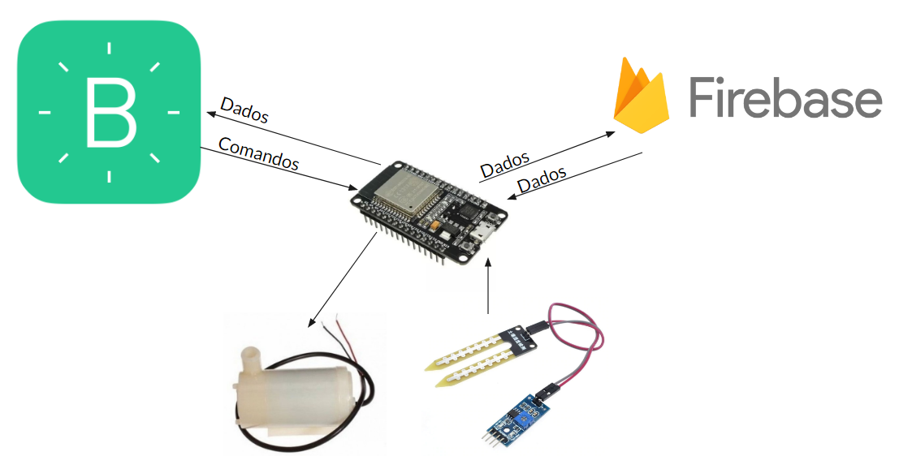
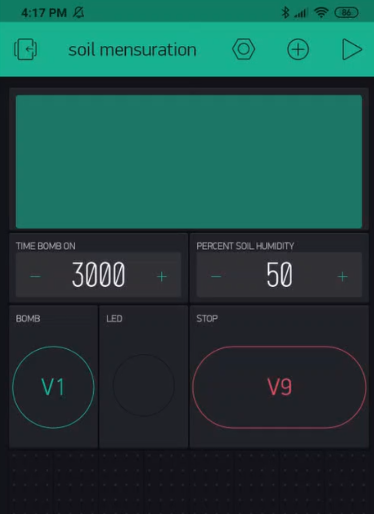

# Smart-Garden-Blynk-Firebase
This project aims to control the activation of a water pump to control soil moisture.

# Goal 

The system aims to control a water pump according to the soil moisture. The sensor is read within a time interval, checking that the humidity is below the user-defined base soil moisture. The pump is turned on within a time interval, also defined by the user. The pump can be activated manually.

# System Overview
The system overview is shown in figure 1. 

# System Control

System control is performed with the Blynk application.
Blynk is a mobile application in which it is possible to develop an interface with buttons, data visualization and other widgets.
The application screen was as shown in Figure 2.

# Data Base

Integration with Firebase was carried out, in which it functions as a database to store reference values within the system.

